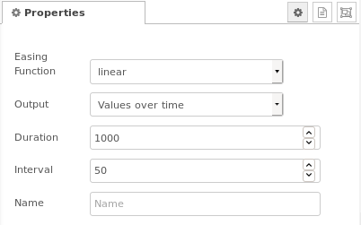
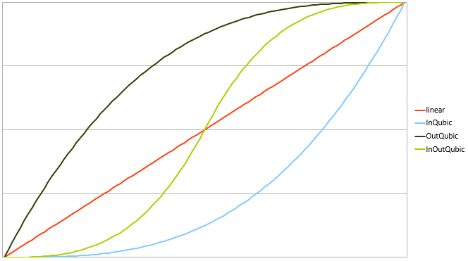
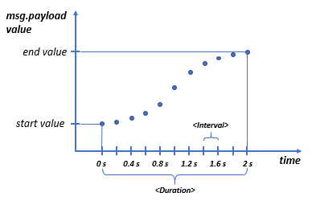
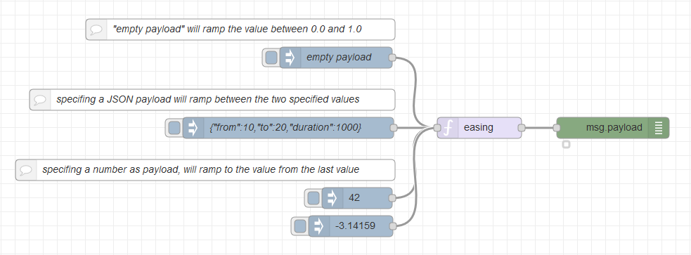
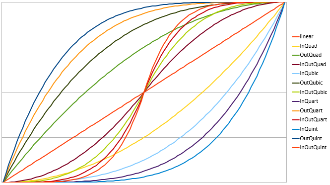
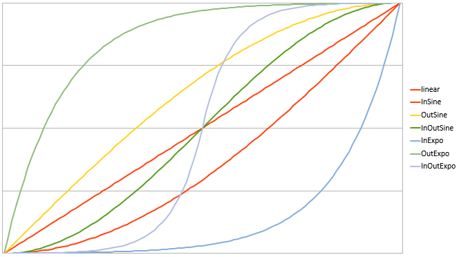
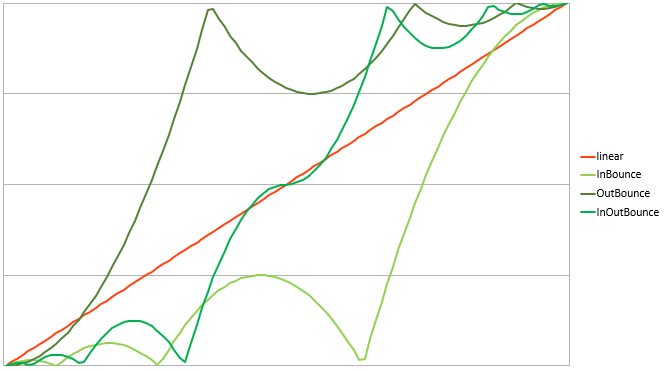

# Node Red Contrib Easing

A node that ramps up a value from a start to an end value using an easing function. Output values are values over time or values within an array.
Typical use cases are smoothing command value changes to avoid large steps.  
  
**Fig. 1:** Node appearance

<a name="installation"></a>
## Installation

<a name="installation_in_node-red"></a>
### In Node-RED
* Via Manage Palette -> Search for "node-red-contrib-easing"

<a name="installation_in_a_shell"></a>
### In a shell
* go to the Node-RED installation folder, in OS X it's usually: `~/.node-red`
* run `npm install node-red-contrib-easing`

<a name="usage"></a>
## Usage

<a name="node_conifguration"></a>
### Node Configuration

  
**Fig. 2:** Node properties

#### Easing function
The transition from the start to the end value follows a functional behaviour. These transiton profiles are divided into three categories depending on the easing function name:
* easeIn...: These are profiles where the starting section is very smooth and the ending section contains a sharp bend.
* easeOut...: These are profiles where the starting section contains a sharp bend and the ending section is very smooth.
* easeInOut...: These are profiles where starting and ending sections are quite smooth.

The behaviour of these three categories is shown by the means of the sinoidal functions in Figure 3.
  
**Fig. 3:** Easing function categories (In, Out, InOut)


Several easing funtions are selectable in the node configuration. These are:
* linear
* 2nd order / parabolic (easeIn, easeOut, easeInOut)
* 3rd order / cubic (easeInCubic, easeOutCubic, easeInOutCubic)
* 4th order (easeInQuart, easeOutQuart, easeInOutQuart)
* 5th order (easeInQuint, easeOutQuint, easeInOutQuint)
* sinusodial (easeInSine, easeOutSine, easeInOutSine)
* exponential (easeInExpo, , easeOutExpo, easeInOutExpo)
* bouncing (bounceIn, bounceOut, bounceInOut)

The profiles of these functions are shown below. See chapter [Transition profiles of the easing functions](#transition_profiles) for details.

<a name="input"></a>
### Input
Depending on the type of the `msg.payload` the `easing` node behaves differently ramping with the selected easing function:
1. **No payload** (empty string)
In the case of an empty string within the `msg.payload`, the `easing` node ramps from 0.0 to 1.0.
2. **Number as payload**
If the `msg.payload` is a number, the `easing` node ramps from its last value to this number given.
3.  **JSON object as payload**
  * If the `msg.payload` contains a JSON object in the format: { "from" : 1, "to" : 10, "duration": 200 }, it will ramp between these two values (&lt;from&gt;, &lt;to&gt;) within the given &lt;duration&gt; (in milliseconds).
  * If the `msg.payload` contains a JSON object in the format: { "from" : 1, "to" : 10, "size": 10 }, it will ramp between these two values (&lt;from&gt;, &lt;to&gt;), giving an array of &lt;size&gt; values.


<a name="output"></a>
### Output

#### Output - Values over time vs. array data
xxx

#### Output - Values over time
xxx
Duration: Sets duration of the easing function.
Interval: Sets interval in which values are emitted.
(in ms)
xxx Erläuterung: Interval: Stufigkeit, Duration/Interval: Stufenanzahl

  
**Fig. 4:** Values over time (&lt;duration&gt;, &lt;interval&gt; in ms)


#### Output - Array
xxx
Size: Selects number of elements if output is set to array.


<a name="further_information"></a>
### Further information
Check Node-REDs info panel to see more information on how to use the easing node.

<a name="example"></a>
## Example

The example flow shows the three options of input data via the injecting nodes.

  
**Fig. 5:** Easing example

```json
[{"id":"98c9f381.9ff4d8","type":"easing","z":"b790191a.b48268","name":"","easingType":"easeInOutSine","outputType":"overTime","duration":"10000","interval":50,"numberOfValues":"100","x":860,"y":640,"wires":[["1c98c61a.486e32"]]},{"id":"1f7741b6.5f97c6","type":"inject","z":"b790191a.b48268","name":"empty payload","topic":"","payload":"","payloadType":"str","repeat":"","crontab":"","once":false,"onceDelay":0.1,"x":656,"y":540,"wires":[["98c9f381.9ff4d8"]]},{"id":"4680d5d4.87aa84","type":"inject","z":"b790191a.b48268","name":"{\"from\":10,\"to\":20,\"duration\":1000}","topic":"","payload":"{\"from\":10,\"to\":20,\"duration\":1000}","payloadType":"json","repeat":"","crontab":"","once":false,"onceDelay":0.1,"x":588,"y":640,"wires":[["98c9f381.9ff4d8"]]},{"id":"c3340041.875038","type":"inject","z":"b790191a.b48268","name":"","topic":"","payload":"42","payloadType":"num","repeat":"","crontab":"","once":false,"onceDelay":0.1,"x":686,"y":740,"wires":[["98c9f381.9ff4d8"]]},{"id":"8ac57108.1cc908","type":"inject","z":"b790191a.b48268","name":"","topic":"","payload":"-3.14159","payloadType":"num","repeat":"","crontab":"","once":false,"onceDelay":0.1,"x":677,"y":780,"wires":[["98c9f381.9ff4d8"]]},{"id":"a81bf204.a4b8b8","type":"comment","z":"b790191a.b48268","name":"\"empty payload\" will ramp the value between 0.0 and 1.0","info":"","x":520,"y":500,"wires":[]},{"id":"9b527086.691238","type":"comment","z":"b790191a.b48268","name":"specifing a JSON payload will ramp between the two specified values","info":"","x":480,"y":600,"wires":[]},{"id":"f507eb28.64d96","type":"comment","z":"b790191a.b48268","name":"specifing a number as payload, will ramp to the value from the last value","info":"","x":470,"y":700,"wires":[]},{"id":"1c98c61a.486e32","type":"debug","z":"b790191a.b48268","name":"","active":true,"tosidebar":false,"console":false,"tostatus":true,"complete":"payload","targetType":"msg","x":1050,"y":640,"wires":[]}]
```  
**Fig. 6:** Easing example flow

<a name="transition_profiles"></a>
## Transition profiles of the easing functions
The following graphs show the normalized transition profiles the user can select.

  
**Fig. 7:** Polynomial profiles

  
**Fig. 8:** Sinoide and exponential profiles

  
**Fig. 9:** Bouncing profiles
